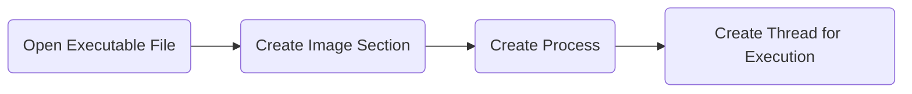
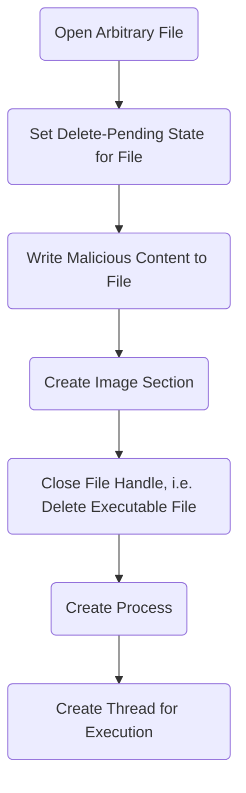

# Process Ghosting

Now You See Me, Now Your EDR Doesn't

  <a href="https://github.com/slidevjs/slidev" target="_blank" class="slidev-icon-btn">
    <carbon:logo-github />
  </a>

---
layout: image-right
image: /edr-bg.jpg
---

# On the Investigation of Rogue Processes

1. Blue teams and EDRs often map processes to
  files on the disk
1. Continue to investigate corresponding disk artifacts¹

<v-click><Question>What if there is no file on disk for the running process?</Question></v-click>

<!--

<v-click><Question>What if there is a completely different (benign) file on disk for the running process?</Question></v-click>
-->

<Footnotes>
  <Footnote number=1>E.g. Process Image Hash, Process Chain</Footnote>
</Footnotes>

<!-- 
- In Blue Teams und EDRs werden oft Dateien auf der Festplatte genutzt, um Verhalten zu erklären
- Dateien werden dann weiter investigiert und z.B. mittels VirusTotal geprüft
- [click] Was wäre, wenn wir einen Prozess ohne Dateien auf der Festplatte erzeugen könnten?\
=> Das ist Ziel von Process Ghosting
 -->

---
transition: slide-up
---

# Process Creation on Windows
All my Homies Love Spawning Processes

<!--
Um Process Ghosting zu verstehen, zuerst Ablauf der Process Creation auf Windows anschauen:
1. Öffnen der Datei, aus der wir einen Prozess erstellen möchten
2. Schreiben der Datei in einen RAM-Abschnitt
  -> Wichtig: Inhalt Speicherabschnitt und EXE-Datei auf Platte sind jetzt entkoppelt, also: Changes im RAM möglich
3. Erstellen des Prozesses (erstmal nur eine Hülle)
4. Erstellen eines Threads und anhängen an den Prozess

Normalerweise alles in einem Schritt für Entwickler, aber: \
Legacy Funktion auf Zeiten vor Windows Vista erlaubt in einzelnen Schritten (wurde früher so gemacht)

Wie werden EDRs in Windows über Prozesserstellungsaktivitäten benachrichtigt?
-->

---
transition: slide-up
---

# Process Creation on Windows
Casting an eye on security vendors' tools supervising Windows' Process Creation

- Register callbacks via `PsSetCreateProcessNotifyRoutineEx`
<!-- Process Support module -> Notify driver about process creation and termination events -->
- Notification when **first thread** is **created**

<v-click>

</v-click>

<!-- TODO: Maybe delete or make timeframes better visible -->

<v-click class="mb-5">
<Important>
There may be a small time window between process creation and security tools being notified about it.
</Important>
</v-click>

<v-click>
<ArrowDraw class="absolute right-55 bottom-31 rotate-225 scale-70 fill-red-5" />
</v-click>

<!--
- EDRs können sog. Callbacks nutzen, d.h.: Wenn X passiert, führe meine Funktion Y aus
- Für ProcessCreation gibt es hier Callback `PsSetCreateProcessNotifyRoutineEx`
- Entgegen dem Namen aber keine Information, wenn Prozess erstellt, sondern wenn erster Thread für Prozess erstellt

- [click] Zeitfenster, in dem wir beliebige Änderungen machen können ohne, dass EDRs dies mitbekommen
- [click] Zwischen Erstellung des Prozesses und Erstellung des ersten zugehörigen Threads
-->

---
layout: two-cols-header
---

# Introducing: Process Ghosting
"Our" Strategy for Hiding from Security Solutions

::left::

Gabriel Landau with Elasticsearch in June 2021² :

- Use Windows file deletion internals to hide process
  - Files are not accessible anymore in Delete Pending state
  - Already open handles remain valid

::right::

<Footnotes>
<Footnote number=2><a href="https://www.elastic.co/de/blog/process-ghosting-a-new-executable-image-tampering-attack">https://www.elastic.co/de/blog/process-ghosting-a-new-executable-image-tampering-attack</a>, last accessed: 25.01.2026</Footnote>
<Footnote number=3>
<code>Nt</code> is an acronym for <i>New Technology</i> stemming from Windows NT (1993)
</Footnote>
</Footnotes>

<!-- Delete Pending == Cannot be opened by for scanning (STATUS_DELETE_PENDING) -->
<!-- I/O after deletion == STATUS_FILE_DELETED -->

<!--
- Gabriel Landau verfeinert
1. Erstellt erst eine unschädliche oder leere EXE-Datei
2. Setzt sie auf den `DELETE_PENDING` Status, d.h. dass keine weiteren Zugriffe auf die Datei mehr möglich sind
3. Hat vom Erstellen noch Zugriff und schreibt jetzt maliziösen Content in Datei
4. Schreibt Datei in Memory
5. Schließt Zugriff auf Datei => Datei gelöscht
6. Erstellt Prozess
7. Erstellt dann Thread für Prozess
-->

---

# Introducing: Process Ghosting

  
 <SlidevVideo v-click autoplay controls class="rounded-lg shadow-xl">
      <source src="/win8-demo.webm" type="video/webm" />
      

        Your browser does not support videos. You may download it
        <a href="/win8-demo.webm">here</a>.
      

    </SlidevVideo>
  

<!--
Kurze Demo wie das aussieht
-->

---
layout: center
---

# Introducing: Process Ghosting
How is MS Defender tricked?

<Footnotes>
<Footnote>Image Source: <a href="https://www.elastic.co/de/blog/process-ghosting-a-new-executable-image-tampering-attack">https://www.elastic.co/de/blog/process-ghosting-a-new-executable-image-tampering-attack</a>, last accessed: 25.01.2026</Footnote>
</Footnotes>

<!--
Warum ist das so gut?
- [click] Wenn MS Defender Datei zur Überprüfung öffnen möchte => DELETE_PENDING, also keine neuen Zugriffe möglich
- [click] Wenn MS Defender unterliegende Datei für Prozess öffnen möchte => FILE_DELETED, Datei schon gelöscht
-->

---
layout: quote
---

"We filed a bug report with MSRC on 2021-05-06, including a draft of this blog post, a demonstration video, and source code for a PoC. They responded on 2021-05-10 indicating that this does not meet their bar for servicing, per https://aka.ms/windowscriteria."²

<!-- MSRC = Microsoft Security Response Center -->

<Footnotes>
<Footnote number=2><a href="https://www.elastic.co/de/blog/process-ghosting-a-new-executable-image-tampering-attack">https://www.elastic.co/de/blog/process-ghosting-a-new-executable-image-tampering-attack</a>, last accessed: 25.01.2026</Footnote>
</Footnotes>

<!--
Gemeldet an Microsoft Security Response Center
aber: Eingreifen scheinbar nicht notwendig
-->

---
layout: image-right
image: /red-team-bg.jpg
---

# Post-Exploitation Possibilities for Red Teamers

<v-clicks>

1. Take tool `$X` and encrypt it⁴
1. Copy encrypted tool and process ghosting tool as executable to victim PC
1. Spawn ghosting tool, decrypt tool in memory and load it in process image
1. Tool `$X` can be executed by spawning a thread without EDRs being able to scan it

</v-clicks>

e.g.: let `$X` = `mimikatz`

<Footnotes>
<Footnote number=4 v-click=1>Simple XOR-Encryption does the job</Footnote>
</Footnotes>

<!--
Wie kann das als Red Teamer genutzt werden?

1. [click] Ich nehme mir ein beliebiges Tool und verschlüssele es (z.B. mit simplen XOR)
1. [click] Kopieren von verschlüsseltem Tool und Process Ghosting EXE auf PC des Opfers
1. [click] Ausführen meiner Ghosting EXE, dann kann ich mein Tool im Speicher wieder entschlüsseln TODO: CHECK
1. [click] Jetzt kann ich mein Tool ausführen, ohne dass es von EDRs gescannt wurde

[click]
Beispieltool wäre Mimikatz
-->

---
layout: center
---

# How Can We Defend Against Process Ghosting?
(Initially)

"Use Elastic Security!" :)

<!--
Wie konnte ich mich dagegen schützen:
- MSRC patcht das nicht
- Report kam von Elastic
- [click] Vorgeschlagene Lösung: Elastic Security benutzen :)
-->

---

# Current Situation?

- Sysmon can detect Event ID 25 "Process Tampering"
- Microsoft rolled out a patch for Windows 10/11, old systems are still vulnerable⁵

`0xc00000bb` = `STATUS_NOT_SUPPORTED`

<Footnotes>
<Footnote number=5>You are problably vulnerable if you have not installed updates since 2021 (I hope you have)</Footnote>
</Footnotes>

<!--
- Selbe Situation schon ca. ein Jahr früher (Process Herpaderping)
- Wieder nicht "bar for servicing" erfüllt
- Sechs Monate später: Sysmon Update um Event zu erkennen -> aber: nur erkennen noch keine Aktion dagegen

x

- Mittlerweile: Gepatched in Win 10 u. 11
- Quasi Shadow Block

[click]
- Beim Ausführen erhält man Fehler, der "STATUS_NOT_SUPPORTED" bedeutet
- Hier an aktuellem Windows 11 mit selbstgeschriebenen Process Ghosting Tool demonstriert
-->

---

# Current Situation?

- Many Antivirus/EDR Companies detect (and block) Process Ghosting/Tampering
- Mostly using AI™/ML™

Microsoft Defender for Endpoint:

<Footnotes>
<Footnote>Image Source: <a href="https://www.microsoft.com/en-us/security/blog/2022/06/30/using-process-creation-properties-to-catch-evasion-techniques/">https://www.microsoft.com/en-us/security/blog/2022/06/30/using-process-creation-properties-to-catch-evasion-techniques/</a>, last accessed: 01.02.2026</Footnote>
</Footnotes>

<!-- CrowdStrike, S1 use Machine Learning, MS Defender Information -->

<!--
- Mittlerweile erkennen und blockieren viele AVs/EDRs Process Tampering mit KI
- MS Defender hat eigene Informatoionsseite dazu
- CrowdStrike und SentinelOne erkennen das scheinbar auch -> Verifizierung schwierig
-->

---
layout: image-right
image: /learning-bg.jpg
---

# What Can We Learn From This?

<v-clicks>

- Albeit certain vulnerabilities do not meet the "bar for servicing", they may be dangerous
- Windows still includes functional legacy code for compatibility reasons (e.g. our used and undocumented `NtProcessCreateEx`⁶), which might be worth exploiting (for pentests)
- Getting creative with Windows Internals can uncover <i v-after>interesting</i> vulnerabilities

</v-clicks>

<Footnotes>
<Footnote number=6><code>NtCreateProcessEx</code> is deemed legacy in current Windows versions</Footnote>
</Footnotes>

<!--
Auch wenn alles schon gepacht, gibt es doch Learnings:
1. [click] Vulnerabilities können gefährlich sein, auch wenn der Hersteller des Produktes das nicht so sieht (aktuelles Beispiel auch wieder: Kubernetes)
2. [click] Windows shippt immer noch mit viel Legacy Code (teilweise undokumentiert) -> hier kann es sich lohnen genauer hinzuschauen
3. [click] Windows Internals sind sehr spannend und können interessante Vulnerablilities zutage fördern
-->

---
layout: center
---

# Thanks for Listening

#
Happy hacking!
|

Sources
Last accessed 06.02.2026

- https://www.elastic.co/de/blog/process-ghosting-a-new-executable-image-tampering-attack
- https://whokilleddb.github.io/blogs/posts/process-ghosting/
- https://www.microsoft.com/en-us/security/blog/2022/06/30/using-process-creation-properties-to-catch-evasion-techniques/
- https://www.hackingarticles.in/process-ghosting-attack/
- https://tarnkappe.info/artikel/it-sicherheit/malware/process-ghosting-neue-malware-technik-trickst-antivirenprogramme-aus-148971.html

<PoweredBySlidev class="absolute bottom-10 left-10 b-none" />
