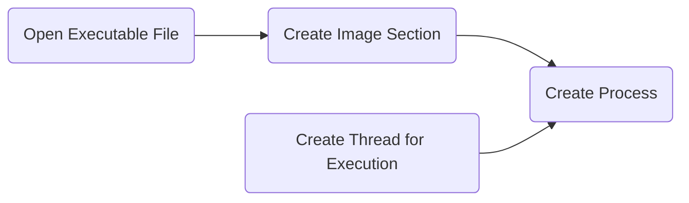
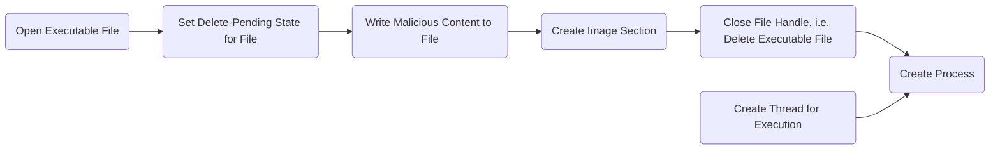
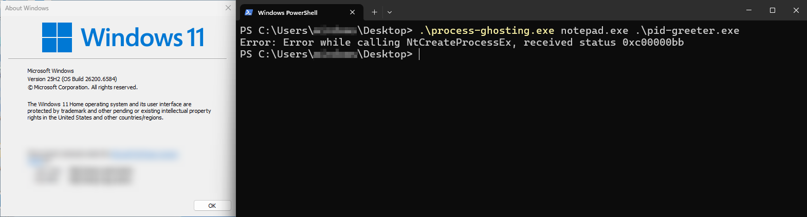

# Process Ghosting and Herpaderping

Now You See Me, Now Your EDR Doesn't

  <a href="https://github.com/slidevjs/slidev" target="_blank" class="slidev-icon-btn">
    <carbon:logo-github />
  </a>

<!-- TODO: Slide Counter in Footer -->

---
layout: image-right
---

# On the Investigation of Rogue Processes

1. Blue teams and EDRs often map processes to
  files on the disk
1. Continue to investigate corresponding disk artifacts¹

<v-click><Question>What if there is no file on disk for the running process?</Question></v-click>

<v-click><Question>What if there is a completely different (benign) file on disk for the running process?</Question></v-click>

<Footnotes>
  <Footnote number=1>E.g. Process Image Hash, Process Chain</Footnote>
</Footnotes>

<!-- TODO: Add process tree screenshot to right -->

---
transition: slide-up
---

# Process Creation on Windows
All my Homies Love Spawning Processes

---
transition: slide-down
---

# Process Creation on Windows
Casting an eye on security vendors' tools supervising Windows' Process Creation

- Register callbacks via `PsSetCreateProcessNotifyRoutineEx`
<!-- Process Support module -> Notify driver about process creation and termination events -->
- Notification when **first thread** is **created**

<v-click>

</v-click>

<v-click class="mb-5">
<Important>
There may be a small time window between process creation and security tools being notified about it.
</Important>
</v-click>

<v-click>
<ArrowDraw class="absolute right-55 bottom-75 rotate-145 scale-70" />
</v-click>

---

# Introducing: Process Ghosting
"Our" Strategy for Hiding from Security Solutions

Gabriel Landau with Elasticsearch in June 2021² :

<Footnotes>
<Footnote number=2><a href="https://www.elastic.co/de/blog/process-ghosting-a-new-executable-image-tampering-attack">https://www.elastic.co/de/blog/process-ghosting-a-new-executable-image-tampering-attack</a>, last accessed: 25.01.2026</Footnote>
<Footnote number=3>
<code>Nt</code> is an acronym for <i>New Technology</i> stemming from Windows NT (1993)
</Footnote>
</Footnotes>

<!-- Delete Pending == Cannot be opened by for scanning (STATUS_DELETE_PENDING) -->
<!-- I/O after deletion == STATUS_FILE_DELETED -->

<!-- TODO: make better readable -->
<!-- TODO: include that NtCreateProcessEx was used before Windows Vista -- legacy now -->

---
layout: center
---

# Introducing: Process Ghosting
How is MS Defender tricked?

<Footnotes>
<Footnote>Image Source: <a href="https://www.elastic.co/de/blog/process-ghosting-a-new-executable-image-tampering-attack">https://www.elastic.co/de/blog/process-ghosting-a-new-executable-image-tampering-attack</a>, last accessed: 25.01.2026</Footnote>
</Footnotes>

---
layout: quote
---

"We filed a bug report with MSRC on 2021-05-06, including a draft of this blog post, a demonstration video, and source code for a PoC. They responded on 2021-05-10 indicating that this does not meet their bar for servicing, per https://aka.ms/windowscriteria."²

<Footnotes>
<Footnote number=2><a href="https://www.elastic.co/de/blog/process-ghosting-a-new-executable-image-tampering-attack">https://www.elastic.co/de/blog/process-ghosting-a-new-executable-image-tampering-attack</a>, last accessed: 25.01.2026</Footnote>
</Footnotes>

---

# Post-Exploitation Possibilities for Red Teamers

1. Take tool `$X` and encrypt it
1. Copy encrypted tool and process ghosting executable to victim PC
1. Spawn a ghost process, decrypt tool in memory and load it in process image
1. Tool `$X` can be executed by spawning a thread without EDRs being able to scan it

---
layout: center
---

# How Can We Defend Against Process Ghosting?
(After M$ Fix)

---

# Current Situation?

- Microsoft rolled out a patch for Windows 10/11, old systems are still vulnerable⁴

`0xc00000bb` = `STATUS_NOT_SUPPORTED`

<Footnotes>
<Footnote number=4>You are problably vulnerable if you have not installed updates since 2021</Footnote>
</Footnotes>

---

# Current Situation?

- Many Antivirus/EDR Companies detect (and block) Process Ghosting

Microsoft Defender for Endpoint:

<Footnotes>
<Footnote>Image Source: <a href="https://www.microsoft.com/en-us/security/blog/2022/06/30/using-process-creation-properties-to-catch-evasion-techniques/">https://www.microsoft.com/en-us/security/blog/2022/06/30/using-process-creation-properties-to-catch-evasion-techniques/</a>, last accessed: 01.02.2026</Footnote>
</Footnotes>

<!-- CrowdStrike, S1 use Machine Learning, MS Defender Information -->

---

# What Can We Learn From This?

- Albeit certain vulnerabilities do not meet the "bar for servicing", they may be dangerous
- Security Teams are not "fault-proof"
- Windows still includes functional legacy code for compatibility reasons (e.g. our used `NtProcessCreateEx`³), which might be worth exploiting

---
layout: center
---

# Thanks for Listening

#
Happy hacking!
|

<PoweredBySlidev class="absolute bottom-10 left-10 b-none" />